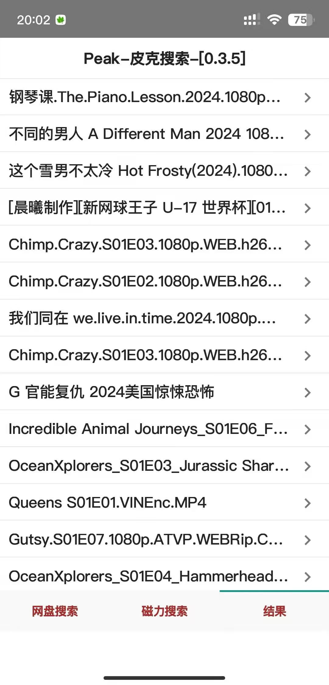

# Peak

*The Search Tool for Android.
for Magnet Search and NetDisk Search.*

note: search speed dependes on internet speed 

</img>
</img>
</img>

v0.4.5 2024/01/31
1. fixed popup tips error.
2. fixed tips.
3. added save html function of netdisk search. save into download folder.

v0.4.0 2025/01/13
1. fixed magnet method 1
2. added magnet method 3
3. fixed duplicate not allowed and arguments out of range error
4. progress bar added

v0.3.5 2024/12/27
1. fixed magnet method 1
2. added net speed rate after search
3. added network error or timeout warning on screen

v0.3.0 2024/12/14
1. added netdisk search method 2

v0.2.5 2024/11/20
1. fixed netdisk search.
2. fixed magnet search method 1. now was ok

v0.2.0 2024/10/19
1. added method 2 magnet search
2. fixed netdisk search method
3. new function in parser added
